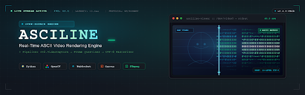
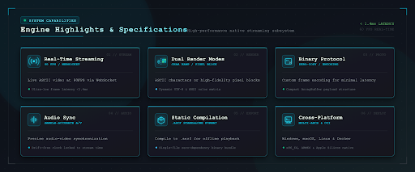
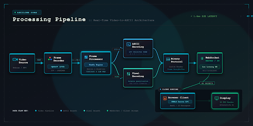

<div align="center">
  
</div>

<p align="center">
  <a href="#-demo">Demo</a> •
  <a href="#-features">Features</a> •
  <a href="#-architecture">Architecture</a> •
  <a href="#-quick-start">Quick Start</a> •
  <a href="#-documentation">Documentation</a>
</p>

---

**ASCILINE** is a high-performance video rendering engine that transforms conventional video frames into real-time **ASCII and pixel-based visual streams**. 

Instead of relying on the browser's traditional `<video>` pipeline, ASCILINE decodes, transforms, compresses, and streams video frames through a custom rendering pipeline — turning the browser into a programmable visual canvas.

<br>

[](#-requirements)
[](https://fastapi.tiangolo.com/)
[](https://opencv.org/)
[](https://www.w3.org/TR/webgpu/)
[](https://www.typescriptlang.org/)

---

## ✨ Features

<div align="center">
  
</div>

* ⚡ **Low-latency WebSocket streaming**
* 🎨 **Multiple color-fidelity modes** (16 colors to 16M+ True Color)
* 🔊 **Precise Audio / Video synchronization**
* 📦 **Custom binary frame protocol** with optional frame compression
* 🧩 **Standalone `.ascf` compilation pipeline**
* 📐 **Automatic aspect-ratio scaling**
* 🖥️ **Windows / macOS / Linux / Docker support**

---

## What It Does

ASCILINE takes conventional video and runs it through a server-side processing pipeline — decoding each frame, mapping pixel luminance and color to ASCII characters (or colored blocks), compressing the result, and streaming it to the browser over a binary WebSocket protocol. The browser renders the incoming text frames onto an HTML5 Canvas at up to 60 FPS.

The result is a fully programmable visual surface: CSS filters, palette swaps, real-time contrast/gamma adjustments — things that would require shader-level access on a normal `<video>` element — become trivial because the stream is just structured text data.

---

## 🎬 Demo (Original vs ASCILINE Output)

Watch the real-time transformation from source video to WebGPU-accelerated ASCII rendering.

| Original Media | ASCILINE Output |
| :---: | :---: |
|  |  |

<br>

*(Note: Real source frame extracted from video and rendered through ASCILINE's ASCII engine.)*

---

## 🖥️ Premium Desktop Workstation UI

ASCILINE features a fully integrated, professional-grade dark mode interface built for high-performance GPU media workflows.

<div align="center">
  
</div>

The workstation UI features:

- **Source Panel** — open local files, connect to live WebSocket streams, or upload directly to the server
- **Render Settings** — character set selection, resolution controls, color mode switching
- **WebGPU/WebGL2 Renderer** — hardware-accelerated canvas output at smooth framerates
- **Transport Controls** — play/pause, seek, skip, timeline scrubbing
- **Real-Time HUD** — FPS counter, connection status, renderer info

---

## 🧠 Architecture

<div align="center">
  
</div>

ASCILINE is a fork of the [original ASCILINE engine](https://github.com/YusufB5/ASCILINE) with a restructured codebase, a new performance-focused `core` module, and a redesigned frontend.

```
                    ┌─────────────────┐
                    │   Video Source   │
                    │  Local / URL /   │
                    │  Webcam / Stream │
                    └────────┬────────┘
                             │
                    ┌────────▼────────┐
                    │  Frame Decoder  │
                    │   (OpenCV)      │
                    │  FPS detection, │
                    │  normalization  │
                    └────────┬────────┘
                             │
                    ┌────────▼────────┐
                    │  ASCII / Pixel  │
                    │    Mapper       │
                    │   (NumPy)       │
                    │  6 color modes  │
                    └────────┬────────┘
                             │
                ┌────────────┼────────────┐
                │            │            │
         ┌──────▼──────┐     │     ┌──────▼──────┐
         │  Adaptive   │     │     │  Terminal   │
         │  Codec      │     │     │  Player     │
         │  ZLIB/DELTA │     │     │  (ANSI)     │
         │  RLE/DCT    │     │     │             │
         └──────┬──────┘     │     └─────────────┘
                │            │
         ┌──────▼──────┐     │
         │  WebSocket  │     │
         │  Binary     │     │
         │  Stream     │     │
         └──────┬──────┘     │
                │            │
         ┌──────▼────────────▼──────┐
         │    Browser Client        │
         │                          │
         │  ┌────────────────────┐  │
         │  │  Jitter Buffer     │  │
         │  │  Frame Decoder     │  │
         │  │  Canvas Renderer   │  │
         │  │  Audio Sync        │  │
         │  │  (master clock)    │  │
         │  └────────────────────┘  │
         │                          │
         └──────────────────────────┘
```

### What This Fork Adds

| Component | Description |
| :--- | :--- |
| **`core/adaptive.py`** | Adaptive quality controller — automatically scales resolution and FPS based on real-time frame processing performance. Ramps down under sustained load, recovers when headroom returns. |
| **`core/frame_queue.py`** | Bounded frame queue with automatic old-frame eviction. Keeps playback close to real-time when the encoder falls behind instead of buffering indefinitely. |
| **`core/performance.py`** | Zero-dependency performance monitor — tracks FPS, frame time, dropped frames, queue depth, and bandwidth over a sliding window. |
| **`core/benchmarks/`** | Synthetic benchmark runner that simulates frame processing workloads and reports adaptive controller behavior. |
| **`core/tests/`** | Unit tests for the adaptive controller and frame queue. |
| **`app.js`** | New frontend integration layer mapping the redesigned UI to the backend. |
| **Redesigned UI** | Cyberpunk-themed dark mode interface with source panel, render settings, WebGPU renderer status, and transport controls. |

---

## 🎨 Rendering Modes

ASCILINE supports multiple visual fidelity levels, from classic terminal aesthetics to high-density pixel rendering.

| Mode | Color Depth | Description |
| :---: | :--- | :--- |
| `1` | Black & White | Classic terminal text |
| `2` | 64 colors | Low-color rendering |
| `3` | 512 colors | Medium color |
| `4` | 32K colors | High color |
| `5` | 262K colors | Very high color |
| `6` | 16M colors | Ultra |

**Pixel Mode**: Replaces traditional ASCII characters with colored block characters (`█`) for significantly higher visual fidelity while preserving the text-based architecture.
```bash
python ASCILINE/stream_server.py video.mp4 --pixel --cols 600
```

---

## Adaptive Quality System

The `core/adaptive.py` module automatically adjusts rendering quality based on real-time performance:

```
Frame Processing Time
        │
        ▼
   ┌─────────┐     Overloaded for 5+ frames
   │ Monitor ├──────────────────────────────▶ Scale DOWN
   │         │                                 • Reduce columns (×0.90)
   │         │     Healthy for 120+ frames     • Reduce FPS (if at min cols)
   │         ├──────────────────────────────▶ Scale UP
   └─────────┘                                 • Increase columns (×1.05)
                                               • Increase FPS (if at max cols)
```

Configuration:

```python
from core import AdaptiveController, AdaptiveConfig

controller = AdaptiveController(
    columns=240,
    target_fps=60,
    config=AdaptiveConfig(
        min_columns=80,
        max_columns=320,
        min_fps=15,
        max_fps=60,
    ),
)
```

---

## 🚀 Installation & Setup

### Requirements

- Python 3.9+
- FFmpeg & FFprobe
- Modern browser (Canvas + WebSocket support)
- Git

### Setup

```bash
git clone https://github.com/kushal98457-ctrl/ASCILINE.git
cd ASCILINE
```

Install dependencies:

```bash
pip install fastapi uvicorn opencv-python numpy websockets
```

> **Headless / server environments:** use `opencv-python-headless` instead.

Optional — YouTube support:

```bash
pip install yt-dlp
```

### FFmpeg

```bash
winget install ffmpeg          # Windows
brew install ffmpeg            # macOS
sudo apt install ffmpeg        # Linux
```

---

## Usage Examples

```bash
# Single video
python ASCILINE/stream_server.py video.mp4 --cols 240

# Pixel mode (high fidelity colored blocks)
python ASCILINE/stream_server.py video.mp4 --pixel --cols 560

# YouTube URL
python ASCILINE/stream_server.py "https://youtu.be/VIDEO_ID" --cols 240

# Webcam
python ASCILINE/stream_server.py --webcam --cols 240

# Folder of videos
python ASCILINE/stream_server.py --folder videos --cols 200 --loop

# Terminal-only mode (no browser)
python ASCILINE/ascii_video_player2.py video.mp4 --cols 100
```
Open **http://localhost:8000** in your browser.

---

## 🗂️ Advanced Configuration

### Playlist System
Queue multiple videos with varying properties using a `playlist.json`:
```json
[
    {
        "video": "intro.mp4",
        "mode": 1,
        "vol": 1
    },
    {
        "video": "main.mp4",
        "mode": 6,
        "pixel": true,
        "vol": 3,
        "cols": 520
    }
]
```

### Static Compilation
Compile videos into a custom `.ascf` format for static hosting environments:
```bash
python compiler.py video.mp4 --cols 250 --pixel
```

---

## Running Tests

```bash
# Adaptive controller tests
python -m pytest core/tests/test_adaptive.py -v

# Frame queue tests
python -m pytest core/tests/test_frame_queue.py -v

# Performance benchmark
python -m core.benchmarks.benchmark_performance
```

---

## 🐳 Docker Support

Run ASCILINE fully containerized:

```bash
docker build -t asciline .
docker run -p 8000:8000 asciline
```

For multi-container configuration:
```bash
docker compose up --build
```
Or manually:
```bash
docker build -t asciline ./ASCILINE
docker run -p 8000:8000 -v $(pwd)/videos:/app/videos asciline
```

---

## Troubleshooting

| Problem | Solution |
| :--- | :--- |
| Audio/video desync | Lower `--cols` — your machine can't encode fast enough |
| `ffmpeg` not found | Install via package manager or drop binaries next to `stream_server.py` |
| YouTube fails | Install `yt-dlp`: `pip install yt-dlp` |
| High CPU usage | Reduce `--cols` or switch from pixel to ASCII mode |
| Terminal output garbled | Don't resize terminal during playback |

---

## Acknowledgments

Built on top of the [ASCILINE](https://github.com/YusufB5/ASCILINE) engine by [YusufB5](https://github.com/YusufB5).

---

## 📜 License

ASCILINE is distributed under the **MIT License (with Anti-Advertisement Restriction)**. 

See the [LICENSE](ASCILINE/LICENSE) file for the complete terms and conditions.

---

<div align="center">

**ASCILINE** — turning video into programmable visual data.

</div>
