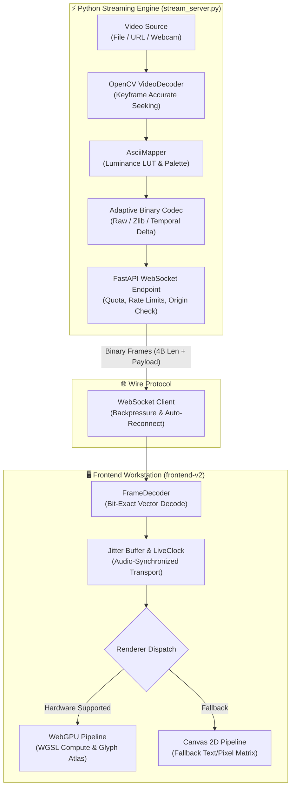

<div align="center">

# ⚡ ASCILINE
### High-Performance Real-Time Video-to-ASCII & Pixel Streaming Engine

**Stream live video converted to ASCII glyphs and dense pixel matrices in real-time over adaptive binary WebSockets to a hardware-accelerated WebGPU & Canvas workstation.**

<br>

<p align="center">
  <a href="#-workstation-ui"><b>Workstation UI</b></a> •
  <a href="#-key-features"><b>Features</b></a> •
  <a href="#-system-architecture"><b>Architecture</b></a> •
  <a href="#-rendering-modes"><b>Rendering Modes</b></a> •
  <a href="#-quick-start"><b>Quick Start</b></a> •
  <a href="#-cli-reference"><b>CLI Reference</b></a> •
  <a href="#-attribution--credits"><b>Attribution</b></a>
</p>

[](https://github.com/kushal98457-ctrl/ASCILINE/actions/workflows/ci.yml)
[](#-quick-start)
[](https://fastapi.tiangolo.com/)
[](#)
[](LICENSE)

</div>

---

## 🖥️ Workstation UI

ASCILINE includes a **desktop workstation UI** engineered for real-time video preview, color grading, and stream control. Built with a clean dark graphite design language, it runs directly in modern browsers via WebGPU with automatic Canvas 2D fallback.

<div align="center">
  
</div>

---

## 🎞️ Processing Fidelity (Input vs Output)

ASCILINE's adaptive NumPy luminance mapping and quantization pipeline preserves tonal gradients, edge definition, and contrast across diverse video inputs.

<div align="center">
  <table>
    <tr>
      <td align="center"><b>Source Media (Original Video)</b></td>
      <td align="center"><b>ASCILINE Render (ASCII Mode 4)</b></td>
    </tr>
    <tr>
      <td width="50%"></td>
      <td width="50%"></td>
    </tr>
  </table>
</div>

<br>

* 🎛️ **Navigation Rail** — Fast switching between media library, rendering settings, stream metrics, and filters.
* 📤 **Browser Uploads** — Drag and drop local video files directly into the streaming server with automated quota management.
* 🎚️ **Live Image Controls** — Real-time adjustment of Contrast, Gamma, Invert, and Character Palettes without interrupting playback.
* 📊 **Telemetry HUD** — Live monitoring of bandwidth (RAW vs WIRE), jitter buffer depth, decode latency, and FPS.
* ⏱️ **Interactive Scrubber** — Hover preview thumbnails powered by on-demand server sprites and sub-second seek accuracy.

---

## ✨ Key Features

| Capability | Description | Specifications |
| :--- | :--- | :--- |
| ⚡ **Real-Time Streaming** | Low-latency binary streaming over WebSocket directly to WebGPU / Canvas surfaces | 24–60 FPS · Sub-frame client rendering |
| 🎨 **Dual Render Modes** | Switch seamlessly between ASCII character ramps and dense colored block pixels | 6 color-fidelity modes (B&W to 16.7M True Color) |
| 📦 **Adaptive Wire Codec** | Custom bit-exact binary protocol eliminating JSON/text overhead | Raw, ZLIB, Temporal Delta, and DCT compression |
| 🛡️ **Hardened Server** | Production-ready safeguards against denial-of-service and disk exhaustion | 5 GB upload quota, rate limits, strict origin validation |
| 🧠 **Adaptive Flow Control** | Dynamic client backlog tracking with automatic frame shedding on congestion | Bounded jitter buffers & master audio clock sync |
| 🗂️ **Playlist Automation** | JSON playlist support with per-video mode, volume, resolution, and looping | YouTube URL streaming & webcam ingest |
| 🐳 **Docker Native** | Containerized deployment with non-root security context and healthchecks | Python 3.11-slim · FFmpeg & OpenCV included |

---

## 🧠 System Architecture

ASCILINE splits video processing and display into a decoupled client-server architecture. Heavy frame transformation (decoding, resizing, luminance mapping, delta compression) runs server-side in Python, while the browser client decodes binary packets and renders via GPU hardware acceleration.



---

## 🎨 Rendering Modes

| Mode | Depth | Palette Description | Aesthetic |
| :---: | :--- | :--- | :--- |
| `1` | 1-bit | Monochrome ASCII | Classic terminal amber/green phosphor look |
| `2` | 6-bit | 64 ANSI colors | Vintage 80s terminal computing feel |
| `3` | 9-bit | 512 colors | Low-bandwidth retro color styling |
| `4` | 15-bit | 32K colors | Rich color reproduction suitable for most videos |
| `5` | 18-bit | 262K colors | Smooth gradients with precise tonal shading |
| `6` | 24-bit | 16.7M True Color | Full RGB precision for studio-grade presentation |

### Pixel Mode (`--pixel`)
Replaces ASCII text glyphs with high-density colored block pixels (`█`), transforming the stream into a retro raster display.

---

## 🚀 Quick Start

### 1. Prerequisites
* **Python 3.9+** (Python 3.11+ recommended)
* **FFmpeg & FFprobe** installed and available on system `PATH`
* Modern browser with WebGPU or HTML5 Canvas support (Chrome, Edge, Firefox, Safari)

### 2. Installation

```bash
# Clone the repository
git clone https://github.com/kushal98457-ctrl/ASCILINE.git
cd ASCILINE

# Install Python runtime dependencies
pip install -r requirements.txt
```

*For developer and test tooling:*
```bash
pip install -r requirements-dev.txt
```

### 3. Start Streaming

```bash
# Launch server with default sample or upload-ready mode
python stream_server.py

# Or stream a specific video file directly
python stream_server.py path/to/video.mp4 --cols 240
```

Open **http://localhost:8000** in your browser to interact with the workstation.

---

## 💻 CLI Reference

```bash
python stream_server.py [options] [video]
```

### Source Arguments
* `video` — Path to video file or URL (default: `video.mp4` or upload-ready mode).
* `--playlist FILE` — Path to JSON playlist file.
* `--folder DIR` — Stream all videos inside a folder in filesystem order.
* `--webcam` — Stream directly from connected webcam.
* `--webcam-device N` — Webcam device index (default: `0`).

### Rendering Options
* `--mode {1,2,3,4,5,6}` — Color depth mode (default: `1`).
* `--pixel` — Enable colored block pixel mode.
* `--cols N` — Grid columns (default: `200` for text, `450` for pixel).
* `--rows N` — Grid rows (default: `0` for auto aspect-ratio calculation).

### Playback & Compression
* `--quality {lossless,high,balanced,low}` — Adaptive codec quality. Lossless maintains bit-exact fidelity; lower modes reduce bandwidth using temporal delta compression.
* `--loop` — Loop the queue or single video indefinitely.
* `--vol {0,1,2,3,4,5}` — Audio volume multiplier (`0` = muted, `1` = normal).
* `--no-thumbnails` — Disable seek bar thumbnail preview sprite generation.

### Server & Security Options
* `--host IP` — Host interface to bind (default: `127.0.0.1`; use `0.0.0.0` for LAN/container).
* `--port PORT` — Server listening port (default: `8000`).
* `--max-clients N` — Max concurrent WebSocket connections (default: `4`). Returns close code `1013` when saturated.
* `--allow-upload` / `--no-allow-upload` — Control browser file uploads (default: enabled on loopback, disabled on public interfaces).
* `--allow-no-origin` / `--no-allow-no-origin` — Allow connections without `Origin` header (default: enabled on loopback, disabled on public interfaces).
* `--debug` — Print live RAW vs WIRE bandwidth compression statistics to console.

---

## 🛠️ Frontend V2 Development

The next-generation WebGPU frontend workstation lives in `frontend-v2/`:

```bash
cd frontend-v2

# Install dependencies
npm ci

# Run development server
npm run dev

# Run unit tests and type checks
npm run typecheck
npm test

# Build production bundle (outputs to frontend-v2/dist)
npm run build
```

The production assets in `frontend-v2/dist` are automatically served by `stream_server.py`.

---

## 🐳 Docker Support

Run ASCILINE inside a secure, non-root container with FFmpeg and OpenCV pre-configured:

```bash
# Using Docker Compose
docker compose up --build

# Or build and run directly with Docker CLI
docker build -t asciline .
docker run -p 8000:8000 -v "${PWD}/videos:/app/videos" asciline
```

---

## 🧪 Testing & Verification

Run the comprehensive test suite locally:

```bash
# Run Python unit tests
pytest -v

# Run Frontend Vitest tests
cd frontend-v2 && npm test

# Run bit-exact wire codec vector verification
python experiments/gen_vectors.py test_vectors.bin
node experiments/check_vectors.js test_vectors.bin
```

Refer to [`test/README.md`](test/README.md) for full documentation on test runners and fixtures.

---

## 🤝 Attribution & Credits

* **Original Concept & Implementation**: [YusufB5](https://github.com/YusufB5) ([YusufB5/ASCILINE](https://github.com/YusufB5/ASCILINE)).
* **Enhancements & Maintenance**: [Kushal](https://github.com/kushal98457-ctrl) — WebGPU frontend workstation (`frontend-v2`), CI test automation, security hardening, upload quota management, and adaptive streaming optimizations.

---

## 📜 License

Distributed under the **MIT License (with Anti-Advertisement Restriction)**.
See the [LICENSE](LICENSE) file for full details.
