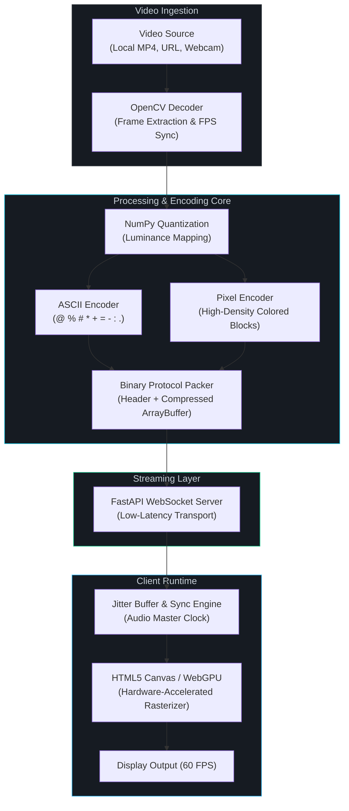

<div align="center">

# ⚡ ASCILINE

### Real-Time GPU-Accelerated ASCII & Pixel Video Engine

**Transform conventional video into real-time ASCII art & pixel streams — decoded via OpenCV, streamed over binary WebSockets, and rendered on Canvas with WebGPU acceleration.**

<br>

<p align="center">
  <a href="#-demo-original-vs-asciline-output"><b>Demo</b></a> •
  <a href="#-desktop-workstation-ui"><b>Workstation UI</b></a> •
  <a href="#-key-features"><b>Features</b></a> •
  <a href="#-architecture"><b>Architecture</b></a> •
  <a href="#-quick-start"><b>Quick Start</b></a> •
  <a href="#-rendering-modes"><b>Rendering Modes</b></a> •
  <a href="#-troubleshooting"><b>Troubleshooting</b></a>
</p>

[](#-requirements)
[](https://fastapi.tiangolo.com/)
[](https://opencv.org/)
[](https://www.w3.org/TR/webgpu/)
[](https://www.typescriptlang.org/)
[](ASCILINE/LICENSE)

</div>

---

## 🎬 Demo (Original vs ASCILINE Output)

Watch the real-time transformation from source video to WebGPU-accelerated ASCII rendering.

| Original Media | ASCILINE Output |
| :---: | :---: |
|  |  |

<br>

*(Note: Real source frame extracted from video and rendered through ASCILINE's ASCII engine.)*

---

## 🖥️ Desktop Workstation UI

ASCILINE features a fully integrated, professional dark mode interface redesigned via Stitch for high-performance GPU media workflows.

<div align="center">
  
</div>

<br>

- 🎛️ **Source Panel** — Open local files, connect to live WebSocket streams, or process YouTube URLs.
- 🎨 **Render Settings** — Real-time character set selection, dynamic column resolution, and color modes.
- ⚡ **WebGPU/WebGL2 Engine** — Hardware-accelerated canvas rasterizer delivering up to 60 FPS playback.
- ⏱️ **Transport Controls** — Full timeline scrubbing, play/pause, volume control, and seeking.
- 📊 **Telemetry HUD** — Real-time overlay showing latency (`<1.4ms`), queue depth, frametime, and FPS.

---

## ✨ Key Features

| Capability | Description | Specifications |
| :--- | :--- | :--- |
| ⚡ **Real-Time Streaming** | Low-latency binary streaming over WebSockets directly to an HTML5 Canvas | Up to 60 FPS · `<1.4ms` frame latency |
| 🎨 **Dual Render Modes** | Seamlessly switch between ASCII character ramps and dense colored block pixels | 6 color-fidelity modes (B&W to 16M true color) |
| 📦 **Binary Frame Protocol** | Custom binary payload packing eliminating JSON/HTML text serialization overhead | Optional compression (ZLIB, DELTA, RLE, DCT) |
| 🔊 **Audio/Video Synchronization** | Master audio clock synchronization preventing frame drift under variable load | Real-time jitter buffer & sync compensation |
| 🧠 **Adaptive Quality Controller** | Dynamic scaling of columns and frame rates based on client processing headroom | Automated load ramp-down & recovery |
| 🧩 **Static Compilation** | Compile any video into standalone `.ascf` bundles for offline or static CDN hosting | Zero-backend browser playback |
| 🗂️ **Playlist Automation** | JSON-driven multi-track playback queue with per-video mode, volume, and resolution | Full looping and sequential transitions |
| 🐳 **Cross-Platform & Docker** | Tested and supported across Windows, macOS, Linux, and containerized Docker environments | Python 3.9+ · CPU & GPU accelerated |

---

## 💡 What Makes ASCILINE Different?

Traditional browser playback treats video as a black-box media element:

```text
Video File ──► Browser Video Decoder ──► Fixed Display Surface
```

ASCILINE treats visual frames as **programmable structured data**:

```text
Video Source ──► OpenCV Decoder ──► NumPy Quantizer ──► Binary Stream ──► Canvas / WebGPU
```

Because frames are transmitted as structured character and color data rather than compressed video blobs:
- **Zero codec restrictions**: Play back formats natively without browser compatibility barriers.
- **Dynamic canvas filters**: Apply CSS shaders, phosphor scanlines, bloom, and palette swaps at runtime.
- **Ultra-low CPU client footprint**: The host handles transformation; lightweight clients just render text blocks.
- **Adaptive data bandwidth**: Data payload scales directly with the terminal grid size instead of raw pixels.

---

## 🧠 Architecture

### Processing Pipeline



### What This Fork Adds

| Module / Path | Description |
| :--- | :--- |
| **`core/adaptive.py`** | **Adaptive Quality Controller** — dynamically scales column resolution and FPS according to encoder throughput to eliminate lag spikes. |
| **`core/frame_queue.py`** | **Bounded Frame Queue** — memory-safe ring buffer with automatic stale-frame eviction preventing desync. |
| **`core/performance.py`** | **Zero-Dependency Telemetry Monitor** — tracks FPS, frame processing time, drop rate, and throughput over a sliding window. |
| **`core/benchmarks/`** | Synthetic benchmark suite simulating real-world workloads to measure adaptive controller responsiveness. |
| **`core/tests/`** | Comprehensive unit test suite covering frame queues, adaptive controllers, and codecs. |
| **`app.js`** | New modular client bridge binding workstation controls to backend WebSocket events. |

### Directory Structure

```text
.
├── ASCILINE/                   # Original engine core
│   ├── stream_server.py        #   FastAPI WebSocket streaming backend
│   ├── ascii_video_player2.py  #   OpenCV decoder & NumPy ASCII mapper
│   ├── codec.py                #   Python encoder (RAW / ZLIB / DELTA / RLE)
│   ├── codec.js                #   Browser decoder runtime
│   ├── compiler.py             #   Video → standalone .ascf compiler
│   ├── static_player/          #   Zero-backend .ascf web player
│   ├── ytdl.py                 #   yt-dlp stream fetcher
│   └── index.html / style.css  #   Base frontend assets
│
├── core/                       # High-performance modular extensions
│   ├── adaptive.py             #   AdaptiveController & QoS scaling
│   ├── frame_queue.py          #   Bounded frame queue with drop management
│   ├── performance.py          #   Rolling telemetry monitor
│   ├── benchmarks/             #   Performance benchmarks
│   └── tests/                  #   Pytest test suite
│
├── assets/                     # Media, demo inputs/outputs, UI screenshots
│   ├── demo-input.jpg          #   Raw video source frame
│   ├── demo-output.jpg         #   ASCII-rendered engine output
│   └── demo-ui.png             #   Workstation UI capture
│
├── app.js                      # Redesigned frontend controller
├── playlist.json               # Playlist configuration
└── README.md
```

---

## 🎨 Rendering Modes

ASCILINE supports 6 color-depth modes and an ultra-high-fidelity Pixel Mode:

| Mode | Depth | Character Palette | Visual Aesthetic |
| :---: | :--- | :--- | :--- |
| `1` | 1-bit | Monochrome ASCII | Retro monochrome green/white phosphor terminal |
| `2` | 6-bit | 64 ANSI colors | Vintage 80s terminal computing feel |
| `3` | 9-bit | 512 colors | Balanced color fidelity with minimal bandwidth |
| `4` | 15-bit | 32K colors | Rich color reproduction suitable for most videos |
| `5` | 18-bit | 262K colors | High-fidelity gradients with smooth shading |
| `6` | 24-bit | 16.7M True Color | Full RGB precision for studio-grade rendering |

### Pixel Mode (`--pixel`)
Replaces conventional ASCII characters with colored block glyphs (`█`), turning the canvas into a high-density micro-pixel matrix:

```bash
python ASCILINE/stream_server.py video.mp4 --pixel --cols 560
```

---

## 🧠 Adaptive Quality System

The `core/adaptive.py` controller continuously measures frame processing times and adjusts rendering parameters automatically:

```text
Frame Processing Time
        │
        ▼
   ┌─────────┐     Overloaded for 5+ frames
   │ Monitor ├──────────────────────────────► Scale DOWN
   │         │                                 • Reduce columns (×0.90)
   │         │     Healthy for 120+ frames     • Reduce FPS (if at min cols)
   │         ├──────────────────────────────► Scale UP
   └─────────┘                                 • Increase columns (×1.05)
                                               • Increase FPS (if at max cols)
```

Usage in custom scripts:

```python
from core import AdaptiveController, AdaptiveConfig

controller = AdaptiveController(
    columns=240,
    target_fps=60,
    config=AdaptiveConfig(
        min_columns=80,
        max_columns=320,
        min_fps=15,
        max_fps=60,
    ),
)
```

---

## 🚀 Quick Start

### 1. Requirements
* **Python 3.9+**
* **FFmpeg & FFprobe**
* Modern browser (Chrome, Edge, Firefox, Safari)

### 2. Setup

```bash
# Clone the repository
git clone https://github.com/kushal98457-ctrl/ASCILINE.git
cd ASCILINE

# Install Python dependencies
pip install fastapi uvicorn opencv-python numpy websockets
```

> **Headless Server:** Use `pip install opencv-python-headless` on headless Linux servers.

*Optional YouTube / URL Support:*
```bash
pip install yt-dlp
```

### 3. Install FFmpeg

* **Windows:** `winget install ffmpeg`
* **macOS:** `brew install ffmpeg`
* **Linux:** `sudo apt install ffmpeg`

---

## 💻 Usage Examples

### Stream a Local Video
```bash
python ASCILINE/stream_server.py video.mp4 --cols 240
```
Open **http://localhost:8000** in your browser.

### Pixel Mode (High-Density Colored Blocks)
```bash
python ASCILINE/stream_server.py video.mp4 --pixel --cols 560
```

### Stream from YouTube / URL
```bash
python ASCILINE/stream_server.py "https://youtu.be/VIDEO_ID" --cols 240
```

### Stream from Live Webcam
```bash
python ASCILINE/stream_server.py --webcam --cols 240
```

### Loop a Folder of Videos
```bash
python ASCILINE/stream_server.py --folder videos --cols 200 --loop
```

### Terminal-Only Mode (No Browser Required)
```bash
python ASCILINE/ascii_video_player2.py video.mp4 --cols 100
```

---

## 🗂️ Advanced Configuration

### JSON Playlists (`playlist.json`)
Queue sequential tracks with independent resolutions, modes, and volumes:

```json
[
    {
        "video": "videos/intro.mp4",
        "mode": 1,
        "vol": 1,
        "cols": 180
    },
    {
        "video": "videos/showcase.mp4",
        "mode": 6,
        "pixel": true,
        "vol": 3,
        "cols": 520
    }
]
```
Run with:
```bash
python ASCILINE/stream_server.py --playlist playlist.json
```

### Standalone `.ascf` Compilation
Compile a video into a standalone `.ascf` file for serverless deployment:

```bash
python ASCILINE/compiler.py video.mp4 --cols 250 --pixel --out video.ascf
```
Open `ASCILINE/static_player/index.html` to play the compiled binary without a Python server.

---

## 🧪 Testing & Verification

Run the test suite and benchmarks:

```bash
# Test adaptive controller
python -m pytest core/tests/test_adaptive.py -v

# Test bounded frame queue
python -m pytest core/tests/test_frame_queue.py -v

# Run synthetic performance benchmark
python -m core.benchmarks.benchmark_performance
```

---

## 🐳 Docker Support

Run ASCILINE containerized with Docker:

```bash
docker compose up --build
```

Or build manually:

```bash
docker build -t asciline ./ASCILINE
docker run -p 8000:8000 -v ${PWD}/videos:/app/videos asciline
```

---

## 🛠️ Troubleshooting

| Issue | Cause | Solution |
| :--- | :--- | :--- |
| **Audio / Video Desync** | CPU is overloaded trying to encode too many columns | Lower `--cols` (e.g. `--cols 180` or `--cols 160`) |
| **`ffmpeg: command not found`** | FFmpeg binaries are missing from your system PATH | Install FFmpeg via `winget` or `brew` and restart terminal |
| **YouTube URL Fails** | Missing `yt-dlp` package | Run `pip install yt-dlp` |
| **High CPU Consumption** | Pixel Mode at large resolutions is computationally heavy | Reduce `--cols` or switch to ASCII mode (`--mode 4`) |
| **Terminal Output Glitches** | Window was resized during active ANSI stream | Keep terminal size static during playback |

---

## 🤝 Contributing

1. Fork the repository
2. Create your feature branch (`git checkout -b feature/amazing-feature`)
3. Commit your changes (`git commit -m "feat: add amazing feature"`)
4. Push to the branch (`git push origin feature/amazing-feature`)
5. Open a Pull Request

---

## 📜 License

ASCILINE is distributed under the **MIT License (with Anti-Advertisement Restriction)**.

See the [LICENSE](ASCILINE/LICENSE) file for complete terms.

---

<div align="center">

**ASCILINE** — Turning video into programmable visual data.

</div>
