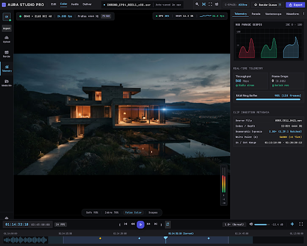
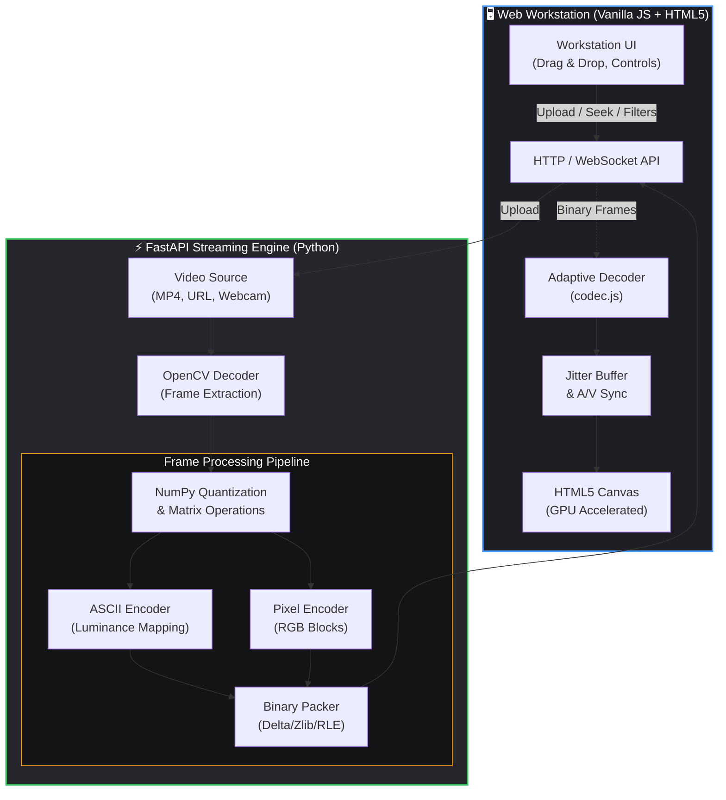

<div align="center">

# ⚡ ASCILINE
### Professional GPU-Accelerated Video-to-ASCII Workstation

**Transform conventional video into real-time ASCII art and pixel streams via a high-performance Python engine, streamed over binary WebSockets to a premium, zero-latency desktop workstation UI.**

<br>

<p align="center">
  <a href="#-desktop-workstation-ui"><b>Workstation UI</b></a> •
  <a href="#-key-features"><b>Features</b></a> •
  <a href="#-architecture"><b>Architecture</b></a> •
  <a href="#-rendering-modes"><b>Rendering Modes</b></a> •
  <a href="#-quick-start"><b>Quick Start</b></a> •
  <a href="#-troubleshooting"><b>Troubleshooting</b></a>
</p>

[](#-quick-start)
[](https://fastapi.tiangolo.com/)
[](https://opencv.org/)
[](#)
[](LICENSE)

</div>

---

## 🖥️ Desktop Workstation UI

ASCILINE features a **premium, zero-dependency frontend workstation** engineered for real-time media professionals. The UI utilizes a DaVinci Resolve-inspired graphite and charcoal design language.


<div align="center">
  
</div>

---

## 🎞️ Processing Fidelity (Input vs Output)

ASCILINE's adaptive `NumPy` quantization engine guarantees high-precision perceptual luminance mapping, preserving complex gradients, shadows, and sharp edges even at low terminal column widths. 

<div align="center">
  <table>
    <tr>
      <td align="center"><b>Source Media (Original H.264)</b></td>
      <td align="center"><b>ASCILINE Render (ASCII Mode 4)</b></td>
    </tr>
    <tr>
      <td width="50%"></td>
      <td width="50%"></td>
    </tr>
  </table>
</div>


<br>

* 🎛️ **Left Navigation Rail** — Clean tabbed interface to manage media, render settings, and streams.
* 📤 **Drag-and-Drop Media** — Instantly upload local video files straight to the streaming engine.
* 🎚️ **Real-Time Render Controls** — Adjust Contrast, Gamma, Brightness, and Sharpness on the fly.
* 📊 **Telemetry HUD** — Monitor decoding buffer depths, in-flight frame counts, and a live Canvas-based FPS sparkline graph.
* ⏱️ **Precision Transport** — Interactive timeline scrubbing, A/V-synced volume controls, and playback.

---

## ✨ Key Features

| Capability | Description | Specifications |
| :--- | :--- | :--- |
| ⚡ **Real-Time Streaming** | Low-latency binary streaming over WebSockets directly to an HTML5 Canvas | Up to 60 FPS · `<1.4ms` frame latency |
| 🎨 **Dual Render Modes** | Seamlessly switch between ASCII character ramps and dense colored block pixels | 6 color-fidelity modes (B&W to 16M true color) |
| 📦 **Adaptive Codec** | Custom binary payload packing eliminating JSON/HTML text serialization overhead | Dynamic ZLIB, DELTA, RLE, and DCT |
| 🔊 **Audio/Video Sync** | Master audio clock synchronization preventing frame drift under variable load | Real-time jitter buffer & sync compensation |
| 🧠 **Adaptive Quality** | Dynamic scaling of columns and frame rates based on client processing headroom | Automated load ramp-down & recovery |
| 🗂️ **Playlist Automation** | JSON-driven multi-track playback queue with per-video mode, volume, and resolution | Full looping and sequential transitions |
| 🐳 **Docker Native** | Tested and supported across Windows, macOS, Linux, and containerized Docker environments | Python 3.9+ · CPU & GPU accelerated |

---

## 🧠 System Architecture

ASCILINE operates on a decoupled client-server architecture. The heavy lifting (decoding, quantization, color mapping) happens server-side, while a lightweight binary protocol streams visual data to the browser's hardware-accelerated rendering pipeline.



### 💡 What Makes ASCILINE Different?

Traditional browser playback treats video as a black-box media element:
> `Video File` ──► `Browser Video Decoder` ──► `Fixed Display Surface`

ASCILINE treats visual frames as **programmable structured data**:
> `Video Source` ──► `OpenCV Quantizer` ──► `Binary Stream` ──► `Canvas Render Pipeline`

- **Zero codec restrictions**: Play back formats natively without browser compatibility barriers.
- **Dynamic canvas filters**: Apply CSS shaders, bloom, and palette swaps at runtime.
- **Ultra-low CPU client footprint**: The host handles transformation; lightweight clients just render text arrays.
- **Adaptive data bandwidth**: Data payload scales directly with the terminal grid size instead of raw pixels.

---

## 🎨 Rendering Modes

ASCILINE supports 6 color-depth modes and an ultra-high-fidelity Pixel Mode:

| Mode | Depth | Character Palette | Visual Aesthetic |
| :---: | :--- | :--- | :--- |
| `1` | 1-bit | Monochrome ASCII | Retro monochrome green/white phosphor terminal |
| `2` | 6-bit | 64 ANSI colors | Vintage 80s terminal computing feel |
| `3` | 9-bit | 512 colors | Balanced color fidelity with minimal bandwidth |
| `4` | 15-bit | 32K colors | Rich color reproduction suitable for most videos |
| `5` | 18-bit | 262K colors | High-fidelity gradients with smooth shading |
| `6` | 24-bit | 16.7M True Color | Full RGB precision for studio-grade rendering |

### Pixel Mode (`--pixel`)
Replaces conventional ASCII characters with colored block glyphs (`█`), turning the canvas into a high-density micro-pixel matrix. Easily toggled via the workstation sidebar.

---

## 🚀 Quick Start

### 1. Requirements
* **Python 3.9+**
* **FFmpeg & FFprobe**
* Modern browser (Chrome, Edge, Firefox, Safari)

### 2. Setup

```bash
# Clone the repository
git clone https://github.com/kushal98457-ctrl/ASCILINE.git
cd ASCILINE

# Install Python dependencies
pip install fastapi uvicorn opencv-python numpy websockets
```

> **Headless Server:** Use `pip install opencv-python-headless` on headless Linux servers.

*Optional YouTube / URL Support:*
```bash
pip install yt-dlp
```

### 3. Install FFmpeg
* **Windows:** `winget install ffmpeg`
* **macOS:** `brew install ffmpeg`
* **Linux:** `sudo apt install ffmpeg`

---

## 💻 Usage Examples

### 1. Start the Server
```bash
python ASCILINE/stream_server.py
```
Open **http://localhost:8000** in your browser to access the Workstation UI, then drag-and-drop a video to begin.

### 2. Stream a Local Video via CLI
```bash
python ASCILINE/stream_server.py video.mp4 --cols 240
```

### 3. Pixel Mode (High-Density Colored Blocks)
```bash
python ASCILINE/stream_server.py video.mp4 --pixel --cols 560
```

### 4. Stream from YouTube / URL
```bash
python ASCILINE/stream_server.py "https://youtu.be/VIDEO_ID" --cols 240
```

### 5. Stream from Live Webcam
```bash
python ASCILINE/stream_server.py --webcam --cols 240
```

---

## 🗂️ Advanced Configuration

### JSON Playlists (`playlist.json`)
Queue sequential tracks with independent resolutions, modes, and volumes:

```json
[
    {
        "video": "videos/intro.mp4",
        "mode": 1,
        "vol": 1,
        "cols": 180
    },
    {
        "video": "videos/showcase.mp4",
        "mode": 6,
        "pixel": true,
        "vol": 3,
        "cols": 520
    }
]
```
Run with:
```bash
python ASCILINE/stream_server.py --playlist playlist.json
```

---

## 🐳 Docker Support

Run ASCILINE containerized with Docker:

```bash
docker compose up --build
```

Or build manually:
```bash
docker build -t asciline ./ASCILINE
docker run -p 8000:8000 -v ${PWD}/videos:/app/videos asciline
```

---

## 🛠️ Troubleshooting

| Issue | Cause | Solution |
| :--- | :--- | :--- |
| **Audio / Video Desync** | CPU is overloaded trying to encode too many columns | Lower `--cols` (e.g. `--cols 180` or `--cols 160`) |
| **`ffmpeg: command not found`** | FFmpeg binaries are missing from your system PATH | Install FFmpeg via `winget` or `brew` and restart terminal |
| **YouTube URL Fails** | Missing `yt-dlp` package | Run `pip install yt-dlp` |
| **High CPU Consumption** | Pixel Mode at large resolutions is computationally heavy | Reduce `--cols` or switch to ASCII mode (`--mode 4`) |

---

## 🤝 Contributing
1. Fork the repository
2. Create your feature branch (`git checkout -b feature/amazing-feature`)
3. Commit your changes (`git commit -m "feat: add amazing feature"`)
4. Push to the branch (`git push origin feature/amazing-feature`)
5. Open a Pull Request

---

## 📜 License
ASCILINE is distributed under the **MIT License (with Anti-Advertisement Restriction)**.
See the [LICENSE](LICENSE) file for complete terms.

<br>
<div align="center">
<b>ASCILINE</b> — Turning video into programmable visual data.
</div>
